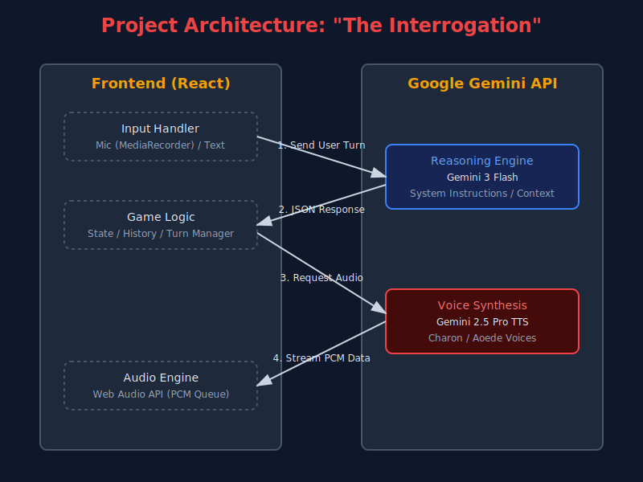

# The Interrogation

Face off against AI detectives in this retro pixel-art interrogation game powered by multi-modal Google Gemini 3 AI. Outsmart the Good Cop and Bad Cop in a high-stakes battle of wits.

## Inspiration
We were inspired by classic noir films and police procedurals like *True Detective* and *Mindhunter*, specifically the intense psychological pressure of the interrogation room. We wanted to see if we could recreate that "Good Cop / Bad Cop" dynamic using generative AI, not just through text, but through voice and personality.

Additionally, we wanted to gamify a crucial piece of civic knowledge: the 5th Amendment. While the goal seems to be proving your innocence, the "secret" winning condition is knowing when to stop talking and ask for a lawyer.

## What it does
The application places the user in a pixel-art interrogation room.
*   **Case Selection:** Users choose from three scenarios ranging in difficulty (Robbery, Homicide, Kidnapping), each with hidden truth states (e.g., the user might actually be innocent but lacks an alibi).
*   **Dynamic AI Opponents:** The game simulates two distinct detectives:
    *   **Det. Harris (Bad Cop):** Aggressive, impatient, and assumes guilt.
    *   **Det. Moore (Good Cop):** Analytical, calm, and manipulative.
*   **Multimodal Interaction:** Players can type their defense or use **Push-to-Talk** to speak directly to the detectives.
*   **Audio Feedback:** The detectives reply with generated audio (Text-to-Speech) with voices matching their personas.

## How we built it
*   **Frontend:** Built with **React** and styled with **Tailwind CSS**. We utilized a retro, pixel-art aesthetic using pure SVGs for the characters and environment to keep the app lightweight.
*   **AI Brain (Logic):** We used **Google Gemini 3 Flash** to handle the game logic. A complex system instruction manages the state, deciding which detective speaks next, tracking suspicion levels, and determining the final verdict (Guilty, Not Guilty, or Lawyer).
*   **AI Voice (TTS):** We utilized **Gemini 2.5 Pro (TTS)** to generate distinct voices for Harris ('Charon') and Moore ('Aoede'), streaming the raw PCM audio data directly to the browser for low-latency playback.
*   **Animation:** The detective portraits feature procedurally generated animations for breathing, blinking, and eye movement, with specific behaviors programmed for each character's personality (e.g., Harris stares intensely; Moore looks around while thinking).

## Challenges we ran into
*   **Audio Streaming & Decoding:** One of the hardest technical hurdles was handling the raw audio stream from the Gemini API. The API returns base64 encoded PCM data. We had to manually decode this into `Int16Arrays`, normalize it to floating-point numbers, and schedule it seamlessly in the browser's AudioContext to prevent "popping" or gaps between chunks.
*   **Prompt Engineering:** Balancing two characters in a single AI prompt was difficult. Early versions had the detectives speaking over each other or forgetting the case details. We had to strictly enforce a JSON schema to manage turn-taking and game state.
*   **Browser Permissions:** Managing microphone permissions and audio autoplay policies across different browsers required robust state management and user interaction triggers.

## Accomplishments that we're proud of
*   **The "Lawyer" Mechanic:** We are proud of the hidden logic that evaluates if the user asks for a lawyer *before* or *after* incrimination. It turns the game into a subtle educational tool about legal rights.
*   **No External Assets:** The entire visual experience is code. The room and the characters are all generated via SVGs, making the application incredibly fast to load.
*   **Real-time Voice Conversation:** Integrating the microphone input with Gemini's reasoning and TTS creates a genuinely fluid conversation loop that feels like a real argument.

## What we learned
*   **The Power of Multimodal AI:** We learned how to weave text generation and audio generation into a single cohesive experience using the Google GenAI SDK.
*   **Context Management:** We learned the importance of hidden context injection—feeding the AI the "Actual Truth" of the crime while instructing it to pretend it doesn't know, simulating the information gap in real police work.

## What's next for The interrogation
*   **Professional Training Simulation:** If fine-tuned on real legal practices and transcripts of actual criminal cases, this platform could evolve into a serious training tool. It could help law students practice client protection strategies or assist junior detectives in learning effective interrogation techniques while adhering to legal boundaries.
*   **3D Graphics & Evidence Visualization:** We plan to transition from pixel art to high-fidelity 3D graphics. Additionally, we want to integrate the **Gemini Nano ("Nano Banana")** model to generate real-time visual representations of evidence mentioned during the interrogation, making the case files come to life.
*   **More Detectives:** Adding a "Rotation" system where different detectives with unique psychological profiles (e.g., the "Lazy Cop" or the "Corrupt Cop") enter the room.

